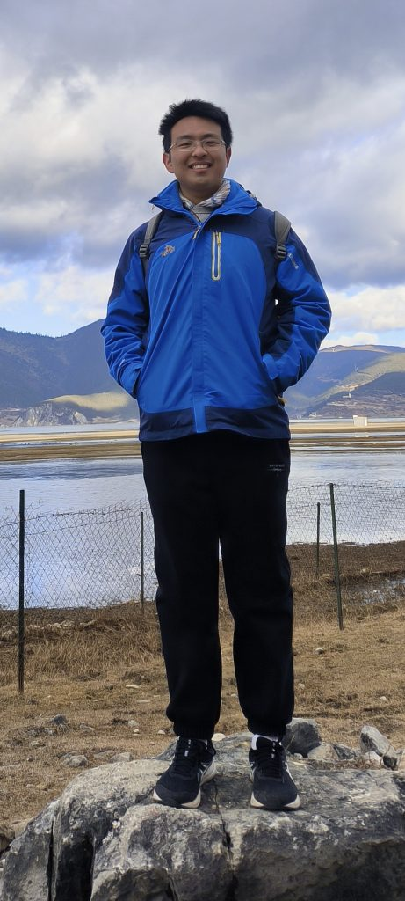

<h1>ZHANG Rushan</h1>
<a href=mailto:rzhangbq@gatech.edu>rzhangbq@gatech.edu</a> 
<a href=mailto:rzhangbq@gmail.com>rzhangbq@gmail.com</a> 
Homepage: <a href="https://rzhangbq.github.io">https://rzhangbq.github.io</a> 
Github: <a href=https://github.com/rzhangbq>rzhangbq</a> 

 
 

 
 
 
 
 
 
 

## Education

- *2024.08 - Present* **The Georgia Institute of Technology (Georgia Tech)**
  - PhD in Machine Learning
- *2020.09 - 2024.06* **The Hong Kong University of Science and Technology (HKUST)**
  - BEng in Aerospace Engineering and BSc in Computer Science
  - Awardee of the [Academic Achievement Medal](https://registry.hkust.edu.hk/academic-achievement-medal) (about top 1% of the class)
- *2022.08 - 2022.12* **The Georgia Institute of Technology (Georgia Tech)**
  - Exchange Student

## Publication

- **DoNet: Deep De-overlapping Network for Microscopy Instance Segmentation**
    - Hao Jiang*, **ZHANG Rushan***, Yanning Zhou, Yumeng Wang, Hao Chen
    - Co-first author
    - Proceedings of the IEEE/CVF Conference on Computer Vision and Pattern Recognition (CVPR) 2023
    - Paper available [here](https://openaccess.thecvf.com/content/CVPR2023/papers/Jiang_DoNet_Deep_De-Overlapping_Network_for_Cytology_Instance_Segmentation_CVPR_2023_paper), codes available [here](https://github.com/DeepDoNet/DoNet)

## Experience

- *2023.09 - 2024.06* **Designing a high-performance airfoil by advanced CFD and machine-learning methods** (Final year design project for aerospace engineering, [Prof. Fu Lin@HKUST](https://seng.hkust.edu.hk/about/people/faculty/lin-fu))
  - Designing, implementing and evaluating machine-learning-based methods for airfoil shape optimization, and comparing results with numerical adjoint methods and experimental results
  - **Inspiration**:
    - Machine learning methods excel in identifying coarse global optima, while numerical adjoint methods excel in refining local optima
    - Combining these two methods could potentially yield improved results
- *2023.09 - 2024.06* **Adversarial or reinforcement learning-based closed-loop training strategy for PINN-based fluid simulators that generalize** (Final year project for computer science, [Prof. Dit-Yan YEUNG@HKUST](https://sites.google.com/view/dyyeung))
  - Designing, implementing and evaluating a closed-loop training strategy for PINN-based fluid simulator with adversarial or reinforcement learning, to achieve enhanced generalizability
  - **Inspiration**:
    - Closed-loop strategy can more efficiently explore the solution space
    - Training strategies like RL and AL can be used to form a closed-loop process
- *2023.06 - 2023.08* **Iterative surrogate model optimization for transient fluid structure interaction** (Summer research, [Prof. Dr. Robert Katzschmann@ETH Zurich](https://srl.ethz.ch/the-group/prof-robert-katzschmann.html))
  - Designing, implementing and evaluating surrogate models for fluid structure interaction, conducting optimization with the resultant surrogate models
  - **Inspiration**:
    - Modeling transient fluid flow as a Markov process to enable single-step prediction of flow evolution
    - Introducing shape representation from the field of computer vision to enable monolithic modeling of fluid-structure interaction
    - Introducing active learning techniques to reduce the number of samples required for optimization
- *2022.02 - 2023.08* **Deep learning for medical image analysis** (Undergraduate research, [Prof. Chen Hao@HKUST](https://seng.hkust.edu.hk/about/people/faculty/hao-chen))
  - Designing, implementing and evaluating a novel de-overlapping strategy for semi-transparent cervical cell segmentation
  - **Inspiration**:
    - Using extra information from the overlapping area and the non-overlapping area to guide the segmentation of the whole cell
  - **Publication**: CVPR2023: [DoNet: Deep De-overlapping Network for Microscopy Instance Segmentation](https://openaccess.thecvf.com/content/CVPR2023/papers/Jiang_DoNet_Deep_De-Overlapping_Network_for_Cytology_Instance_Segmentation_CVPR_2023_paper)
- *2021.06 - 2021.09*, **Digitalization of wet lab project** (Student helper, [Prof. Yang Jinglei@HKUST](https://seng.hkust.edu.hk/about/people/faculty/jinglei-yang) and [WeShare Tech Limited](https://www.wesharetechnology.com))
  - Implementing the hazard warning feature with pop-up windows
  - **Role**:
    - Front-end development with Vue.js

## Extracurricular Activities

- **Aerial robot development team member**, HKUST ENTERPRIZE [Robo Master](https://www.robomaster.com/en-US) Team — 2020 Fall - 2022 Spring
  - Collaborating in a team for mechanical design and manufacturing of robots
- **Hackathon**, [hackUST](https://hackust.agorize.com/en/challenges/hackust-2022) 2022 — 2022 Spring
  - Collaborating in a team for the development of a webapp called School Application Helper, helping students to manage school application requirements and timelines
  - [Github repository](https://github.com/hackUST-2022); [Video demo](https://meeting.tencent.com/user-center/shared-record-info?id=54cf130f-0631-466b-a272-259521fc85a5&from=3)
- **Research assistant**, [Prof. Ki Ling CHEUNG@HKUST](https://isom.hkust.edu.hk/faculty-and-staff/directory/imcheung) — 2022 Summer - 2022 Winter
  - MySQL database maintenance and data washing with Dask
  - Providing technical support for researchers from different technical backgrounds
- **Peer mentor**, COMP & CPEG Mentor-Mentee Scheme — 2023 Fall
  - Providing mentoring to second-year students admitted to the computer science and engineering department
- **Exchange buddy**, Exchange Buddy Program — 2023 Spring, 2023 Fall
  - Helping exchange students navigate the HKUST campus

## Skills

- **C/C++**: C++(intermediate), C(elementary); notes: [C++ basic notes](https://rzhangbq.github.io/cv/C++_basic_notes.html), [C++ OOP notes](https://rzhangbq.github.io/cv/C++_OOP_notes.html)
- **Python**: PyTorch(master), NumPy(master), TensorFlow(intermediate), Django(intermediate), Pandas(intermediate)
- **CAD**: SolidWorks(master)
- **Documentation**: Markdown(master), LaTeX(master)
- **Webapp Development**: Vue.js(intermediate), React.js(elementary), MySQL(intermediate), Google Firebase(elementary)
- **Soft Skills**: Collaboration and leadership, self-learning, self-motivation, time management